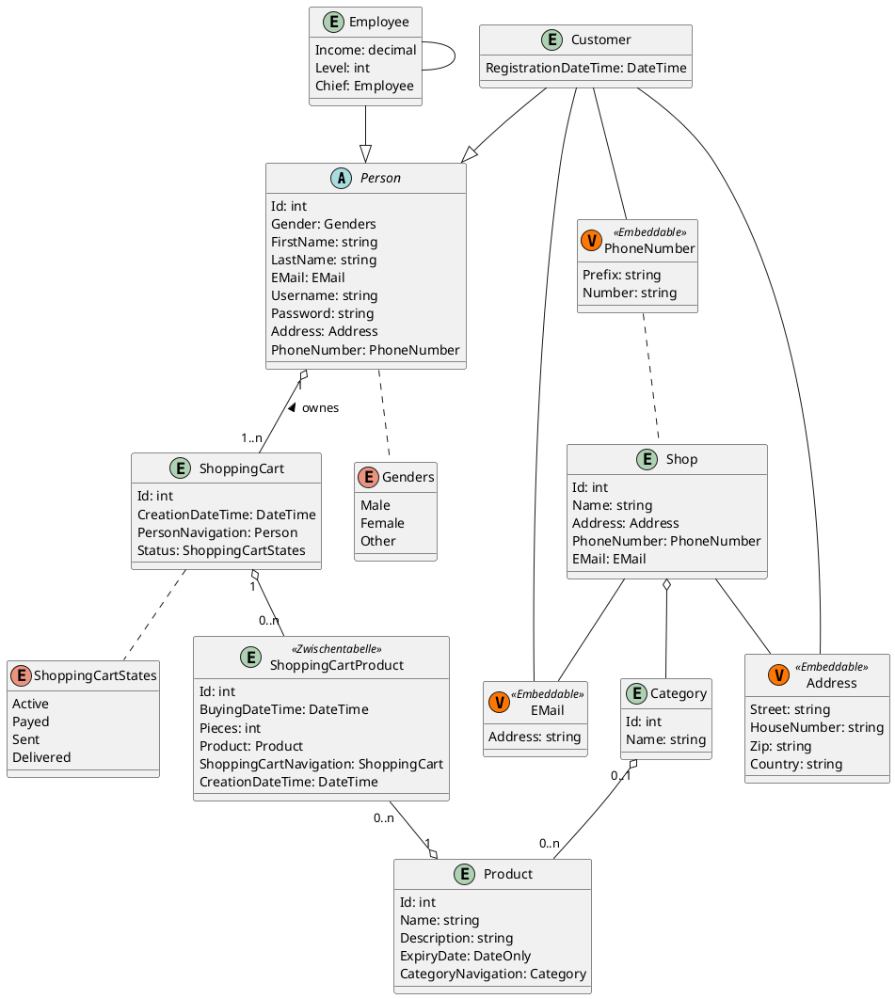

# Unterricht 78ACIF

x

## Projekt

Beschreibung

### Teammitglieder

* A
* B

### Zweck

Beschreibung

### Aufbau

xxxxx

#### Domain Model

```html
<h1>Hello World!</h1>
```



#### C# Example

```C#
<h1>asddsadsadas</h1>

namespace Spg.CollectionsDemo
{
    public class Student : Person
    {
        public int RegistrationNumber { get; set; }
    }
}

```

xxxxxx